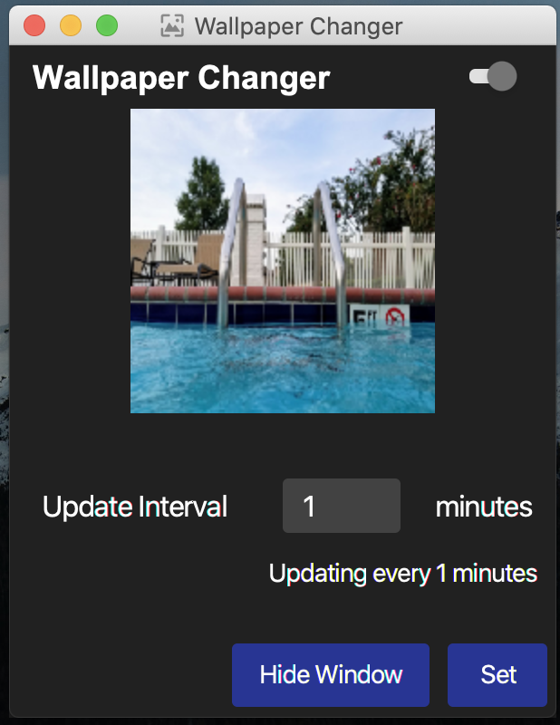
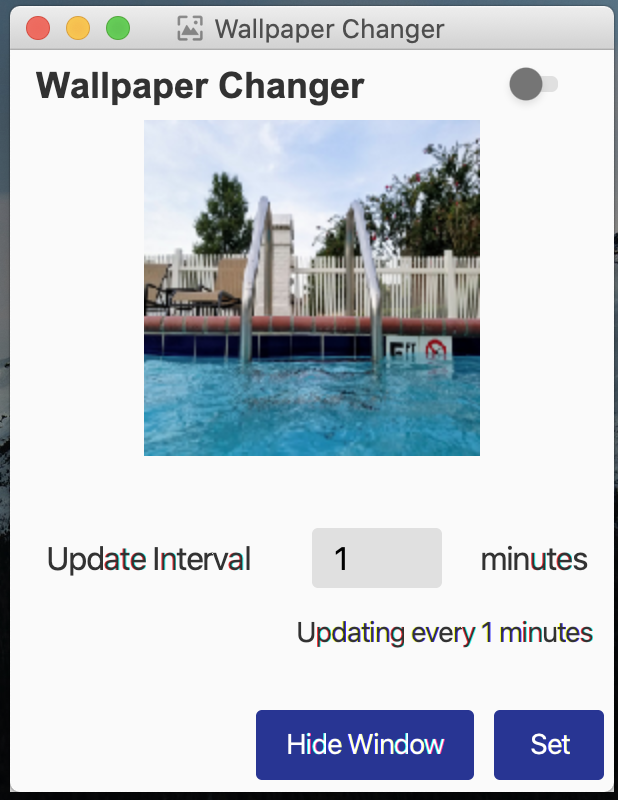

### Wallpaper Changer App

This is a desktop application to update wallpaper periodically
based on set interval. Written in java and uses javafx for the UI.
It uses upsplash for the random pictures.

Currently, this app works only on MS Windows.

To-do
-----
1. Add support for Linux
2. Add support for macOS

### Demo

Application on Dark Theme
\

\
\
\
Light Theme
\
